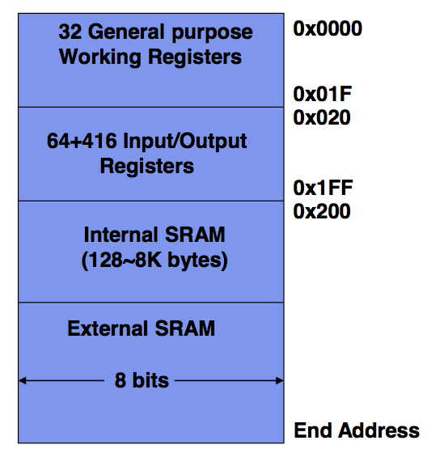
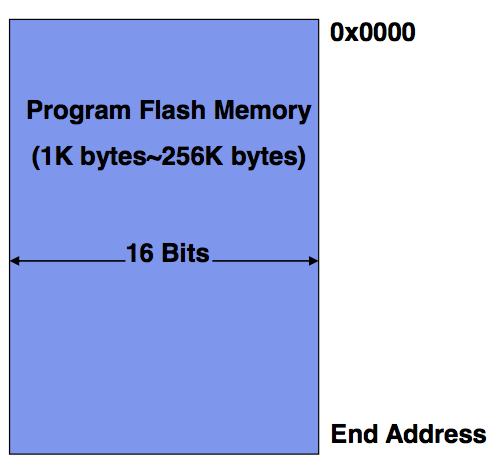

# COMP2121
## Course Info

+ There are 5 sets of lab exercises, 2 weeks to work on each, marked every other week. (can be done and marked early)
+ You will need a usb/some system to take your work away from electrical labs. 
+ Thursday lecture has an hour afterwards for help if needed. 
+ First lab is in week 3

## AVR ISA / Programming

### The Chip
The AVR Industry Standard Architecture (AVR ISA) is governed by the AVR Instruction set and includes:

1. Load-Store memory access architecture
	+ This means all calculations are done on registers, not memory directly. 
	+ Memory is used to **load** to registers or **store** the registers contents. 
2. Two-Stage instruction pipelining
	+ This just means that the processor is designed to split up each instruction into multiple steps
	allowing for the processor to run multiple instructions in parallel. This increases speed as the processor
	can start another instruction before finishing the first as some parts of the new instruction use pieces of the 
	processor not currently active in the previous instructions computation. 
3. Internal Memory
4. lots of on-chip peripherals (hardware add-ons)

### General Registers
The AVR has 32 8-bit registers that are extremely quick to access and work with.
We split these up into two groups, the 0-15 registers (r0-r15) and 16-31 (r16-r31)
This is because some instructions will only be able to function when working with
registers of the second higher number groups. why?
most instructions only have 16 bits to work with so for a command like ldi you have
`1110 kkkk aaaa aaaa`
1110 indicates the command, kkkk is the return register and aaaa aaaa is the address to 
read from. because it only has 4 bits to store the return register, it can only return 
to a maximum possible 16 different registers. Hence why it only works on the second group of registers. 

The following register pairs are commonly used as address indexs
* X - r27:r26
* Y - r29:r28
* Z - r31:r30

note that often data loaded from program memory goes to r0

### I/O Registers

64 + 416 8 bit registers are used in input and output instructions. Mainly for storing data/instructions and control signal bits (to interact with hardware)

now some instructions will only work with i/o registers and not general purpose registers. for example
`in Rd, port` will only work with an i/o register 0-63 and `lds Rd, port` will only work for io registers 64-415
(covered in more detail in the I/O register section)

The **Status Register** in AVR is a special i/o register contains information about the most recent arithmetic instruction. 
flags allow us to extract different information about it. SREG is updated after any ALU operations by hardware. it is a 8 bit section of memory and contains 8 signal bits (in the order 7-6-5-4-3-2-1-0)

| Bit | Flag | What it does                                                  |
| --- | ---- | ------------------------------------------------------------- |
|  7  |  I   | global interrupt enable, used to enable and disable interrupts |
|  6  |  T   | Bit Copy Storage, the bit copy instruction bld (Bit load) and bst (bit store) use the T-bit as a source or destination for the operated bit. If a bit needs to be put somewhere or read in, it is done so from here.|
| 5   |  H   | half carry flag indicates a half carry (carry from bit 4) has occurred in some math|
| 4   |  S   | Exclusive OR between the Negative flag (N) and the Two's complement overflow Flag (V). tells you the sign of the resultant number taking into account if overflow has occurred. i.e what the sign SHOULD BE |
| 3   |  V   | two's complement overflow flag triggers when overflow happens during two's complement arithmetic.|
| 2   |  N   | the negative flag is the most significant bit of the result, i.e is this number negative or not.|
| 1   |  Z   | Z indicates a zero result in some logic or arithmetic operation.|
| 0   |  C   | Carry Flag, its meaning depends on the operation, for example for addition it is the carry from the most significant bit, for subtraction it indicates if the result is negative ( for x-y C is 1 when y > x)|

###AVR Address Spaces

There are 3 address spaces:

**Data Memory Space**

This includes the registers and also System Ram (SRAM).
Note the highest point in this memory is called RAMEND. 



**Program Memory Space**

This includes 16 bit flash memory which is read only. Here the 
instructions are stored. it's non-volatile, which means at sudden power
cuts the data in this is retained. 

If you know what you are doing you _CAN_ access these through lpm and spm. 



**EEPROM Memory Space**

8-bit EEPROM memory is sued to store large data sets permanently. 
not covered in this course. (but can be loaded and set to)


###AVR Instruction Format
most instructions are 1 word long, although a select few are 2 words long 
such as lds which reads 1 byte from SRAM and thus needs to be able to 
take in larger addresses (0 - 65535)

[TODO THE REST OF THIS SHIT]

AVR has a couple of classes of instructions, things like arithmetic and logic, logic being things such as AND, it also has data transfer instructions, program control instructions (jump, skips, subroutine etc.) and good old bit operations. 
there are also other instructions like sleep or nop. Nop is no operation, just a empty cycle of the processor. 

###AVR Addressing modes 

there are 3 main ways AVR refers to addresses. 

**Immediate Addressing**

this is when the operands come FROM the instruction call itself.
You immediately give the instruction what it needs. 

if you wanted to clear the last 4 bits of r16 you would say
`andi r16, 0x0F` also note that a 4 bit block can be call a nibble.
here we are clearing the upper nibble. (it's an AND operation)

**Register Direct Addressing**

when the operands come from general purpose registers or I/O registers. 

`add r16, r0` or `in r25, PINA`

note the in command takes the signal from pin A and puts it in r25. 

**Data Memory Addressing**

there are multiple types of data memory addressing shown below

1. data direct addressing, the address of the memory needed is given
	* `lds r5, 0xF123`
2. indirect addressing, the address is referred to by a address pointer, such as the previously mentioned X Y or Z
	* `ld r11, X`
3. indirect addressing with displacement, just taking a address pointer and shifting it over
	* `std Y+10, r14`
4. indirect addressing with pre-decrement, The data memory address is from an address pointer (X, Y, Z) and the value of the pointer is auto-decreased before each memory access. basically reduce/increase y by 1 permanently, then access the new y address. 
	* `std -Y, r14`
5. indirect addressing with post-decrement, same as above but the value is increased _AFTER_ the memory is used

**Program Memory Addressing**

Similarly, there are multiple types of program memory addressing

1. 

###Commands
note: In AVR a *word* is a 16 bit value

| Command   | Function | Words | Cycles | Comments       |
|-----------|----------|-------|--------|----------------|
| sub Rd, Rr| Rd - Rr  | 1     |      1 | does not carry |
| mul Rd, Rr| Rd*Rr    | 1     |      2 | returns result in r1:r0 as 2 8bit values can give a maximum 16 bit return value also note the flag C is set if bit 15 of the result is set. helping indicate excessively large values rather then overflow which C usually signals. This is because overflow is not possible here| 
| ldi Rd, k | Rd <- k | 1 | 1| loads from address k into Rd |
| mov Rd, Rr| Rd <- Rr | 1| 1| moves one register to another |
| add Rd, Rr| Rd + Rr | 1| 1| doesn't carry |

###Example

lets say we want to calculate `z = 2x - xy - x^2` we can do it as below.
note that when we get a 16 bit result we throw away the least significant half
because we know what we are working with fits within the most significant 8 bits. 
Also note that we use r16 as it will work with any instruction so it's a safe bet.

Assuming x y and z are stored in r2, r3 ad r4 (r0 and r1 are used by mul)

```
ldi r16, 2      		r16 <- 2;
mul r16, r2     		x*2;
mov r5, r0      		r5 <- x*2;
mul r2, r3      		y * x;
sub r5, r0      		r5 <- 2x - y*x;
mul r2, r2      		x*x;
sub r5, r0      		r5 <- 2x-y*x - x^2;
mov r4, r5      		finish;
```
Note that because mul takes 2 cycles we can cut down the time this takes by doing
` z = x(2 - (y + x)) `

## Stacks

## Busses and I/O

## Interrupts

## I/O Devices

## Analog Input and Output

## Number System & Encoding

## Serial Communication
